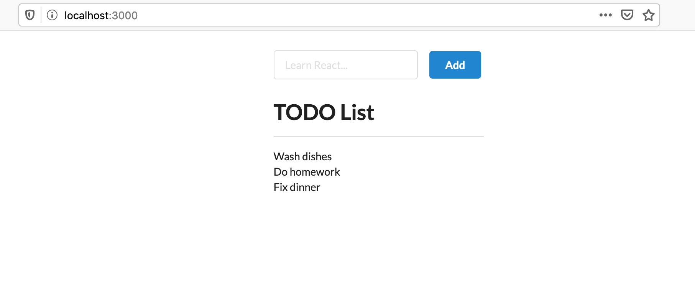

# `react-todo-list-demo`

To run this demo, execute the following:

```
$ git clone git@github.com:Hopding/react-todo-list-demo.git
$ cd react-todo-list-demo
$ npm install
$ npm start
```

This will open `http://localhost:3000` in a new browser tab. The resulting page should look like the following



# Prerequisites

Note that you must have the following tools installed on your system to run this demo:

- [`git`](https://git-scm.com/downloads)
- [`node` and `npm`](https://nodejs.org/en/download/)
